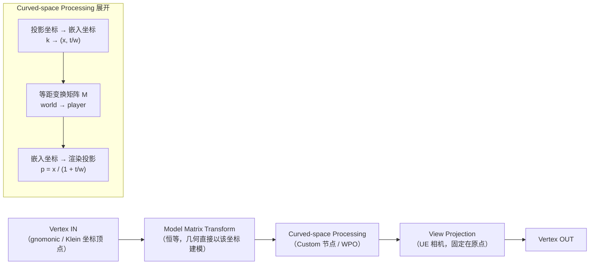
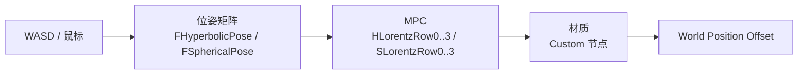

# NonEuclidean3DDemo

在 **Unreal Engine 5.8** 里用普通的三角网格 + 自定义顶点着色器，模拟**非欧几里得几何**渲染。灵感来自 Hyperbolica（CodeParade）的开发日记。

包含两个 demo：

| Demo | 几何 | 曲率 | 关键差异 |
|------|------|------|----------|
| **Hyperbolic** | Poincaré 球 | 负（常负曲率） | 空间无限，走到哪儿都会看到远处物体挤向边界 |
| **Spherical** | S³ 立体投影 | 正（常正曲率） | 空间有限，一直走会绕一圈回到原点 |

---

## 核心思想

**相机固定在原点不动**，玩家的"移动 / 转向"全部表达为一个**等距变换（4×4 矩阵）**，每帧写进材质参数集合（MPC）。材质在**顶点着色器**里把每个顶点投影到屏幕，实现非欧空间的扭曲。

这正是 Hyperbolica 开发日记里那张流程图的思路：



### CPU → GPU 数据流



---

## 数学核心

双曲与球面是完美对偶，共用同一套管线，只差符号和三角函数：

| 概念 | 双曲（负曲率） | 球面（正曲率） |
|------|---------------|---------------|
| 嵌入空间 | 双曲面 `t² - ‖x‖² = 1` | 3-球面 `‖x‖² + w² = 1` |
| 建模坐标（直线仍是直线） | Beltrami-Klein，`‖k‖ < 1` | gnomonic，`k` 无界 |
| 渲染投影（共形） | Poincaré 球 `p = x/(1+t)` | 立体投影 `p = x/(1+w)` |
| 等距变换群 | Lorentz SO(1,3) | 旋转 SO(4) |
| 移动 | boost（`cosh/sinh`） | `(方向, w)` 平面旋转（`cos/sin`） |
| 绕圈走一圈 | 视角自动旋转（holonomy） | 视角同样旋转（holonomy） |

顶点着色器里的转换（双曲版，球面只改 `1 - kk` → `1 + kk`）：

```hlsl
float3 k = WorldPos / BallRadius;         // Klein / gnomonic
float s = rsqrt(1.0f - dot(k, k));        // 双曲：1-kk；球面：1+kk
float4 h = float4(k * s, s);              // -> 双曲面 / 3-球面
float4 hl;
hl.x = dot(M0, h);                        // 等距变换 world -> player
hl.y = dot(M1, h);
hl.z = dot(M2, h);
hl.w = dot(M3, h);
float3 p = hl.xyz / (1.0f + hl.w);        // -> Poincaré / 立体投影
return p * BallRadius - WorldPos;
```

---

## 文件结构

```
Source/NonEuclidean3DDemo/
├── Hyperbolic/                    # 双曲几何 demo
│   ├── HyperbolicMath.h           # FHyperbolicPose：Lorentz boost/旋转/矩阵乘法
│   ├── HyperbolicCameraPawn.*     # 相机：输入 → 更新位姿 → 写 MPC
│   ├── HyperbolicWorldActor.*     # 程序化生成 Klein 坐标立方体格点
│   └── HyperbolicGameMode.*       # 默认 Pawn + 自动生成世界
└── Spherical/                     # 球面几何 demo（结构与双曲平行）
    ├── SphericalMath.h            # FSphericalPose：SO(4) 旋转
    ├── SphericalCameraPawn.*
    ├── SphericalWorldActor.*
    └── SphericalGameMode.*

Content/
├── Hyperbolic/
│   ├── M_Hyperbolic.uasset        # 材质（WPO 连 Custom 节点）
│   ├── MPC_Hyperbolic.uasset      # MPC（承载矩阵 4 行）
│   ├── HyperbolicCustomNode.ush   # Custom 节点 HLSL 参考副本
│   └── setup_*.py                 # 一键生成资产的编辑器脚本
├── Spherical/
│   ├── M_Spherical.uasset
│   └── MPC_Spherical.uasset
└── Level/
    ├── HyperbolicDemo.umap        # 双曲演示关卡
    └── SphericalDemo.umap         # 球面演示关卡
```

---

## 如何运行

1. 用 UE 5.8 打开 `NonEuclidean3DDemo.uproject`
2. 打开 `Content/Level/HyperbolicDemo`（或 `SphericalDemo`）
3. 点击 Play

**操作**：`WASD` 移动 · 鼠标转向 · `R` 复位

> 关卡已在 World Settings 里设好 GameMode override，直接 Play 即可。

---

## 关键参数

| 参数 | 位置 | 说明 |
|------|------|------|
| `MoveSpeed` | `*CameraPawn.h` | 移动速度（cm/s） |
| `CurvatureRadius` | `*CameraPawn.h` | 曲率半径，须与材质 `BallRadius` 一致（默认 100） |
| `BallRadius` | 材质 Custom 节点 | 曲率半径，越小扭曲越早出现 |
| `GridSize / Spacing / CubeSize` | `*WorldActor.h` | 格点密度 / 间距 / 方块大小 |

---

## 参考

- [Hyperbolica](https://store.steampowered.com/app/1741440/Hyperbolica/) — CodeParade 的双曲几何游戏
- [Exploring Hyperbolic Space with VR](https://www.youtube.com/watch?v=zQo_S3yNa2w) — 顶点着色器双曲渲染思路
